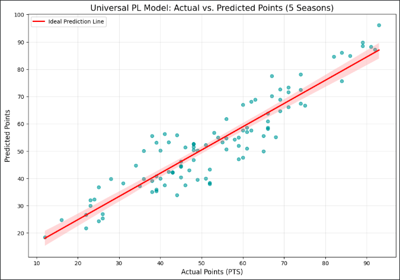
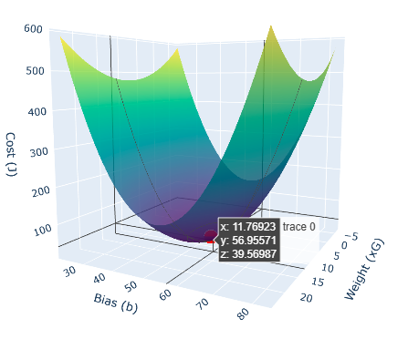

# ⚽ Premier League Performance Predictor: ML from Scratch

## 📌 Project Overview
Can we predict a football team's final points based on their underlying performance? This project implements a **Multiple Linear Regression** model from scratch to analyze 5 seasons of English Premier League data (2020-2025).

The goal was to move beyond simple statistics and build a mathematical engine that understands the weight of offensive and defensive metrics.

## 🚀 Key Technical Features
* **Mathematical Foundation:** Implementation of Vectorized Gradient Descent without high-level ML libraries (like Scikit-Learn).
* **Feature Engineering:** Z-score Normalization applied to balance features with different scales (xG vs. Squad Value).
* **Performance Metrics:** Mean Absolute Error (MAE) tracking to evaluate prediction accuracy.
* **Advanced Visualization:** 3D Cost Function mapping to verify global minimum convergence.

## 🎯 Model Performance: Predicted vs. Actual
To evaluate the model, I plotted the Predicted Points against the Actual Points earned by teams. 

* **Ideal Prediction Line:** The red line represents a perfect match.
* **The Spread:** Most teams cluster closely around the line, showing high predictive accuracy.
* **Overperformers:** Notable exceptions (like Nottingham Forest or Fulham) show where teams defied the statistical expectations of xG and squad value.

## 📊 The "Cost Function" Visualization
This 3D surface plot visualizes how the model "learns". The red marker represents the point where the model's error (Cost) is at its absolute minimum.

## 🧬 Dataset
The model was trained on 100 team-seasons with the following features:
1.  **xG (Expected Goals):** Measuring chance quality.
2.  **xGA (Expected Goals Allowed):** Measuring defensive solidity.
3.  **Squad Value:** Market value of the team to account for financial influence.

## 📈 Results
The model successfully identifies **Expected Goals (xG)** as the strongest predictor of league success, outweighing even squad market value in several analyzed seasons.

---
*Created as part of the Machine Learning Specialization (DeepLearning.AI) journey.*
